# estagio-repo
Documentação de projetos

# Projeto Busca CEP
Uma aplicação simples que realiza uma chamada para a API pública do ViaCEP, retornando dados os dados tratados para o usuário. O objetivo desse projeto era consumir uma API externa e receber esses dados, tratar eles e devolver para a página inicial, facilitando a utilização da aplicação.
Tecnologias utilizadas: HTML5, CSS3, JavaScript, Bootstrap, jQuery, JavaScript e Fetch para realizar chamadas para a API.
Link da aplicação rodando: https://busca-cep-sistemas.vercel.app/

## Busca por CEP
Interface inicial:

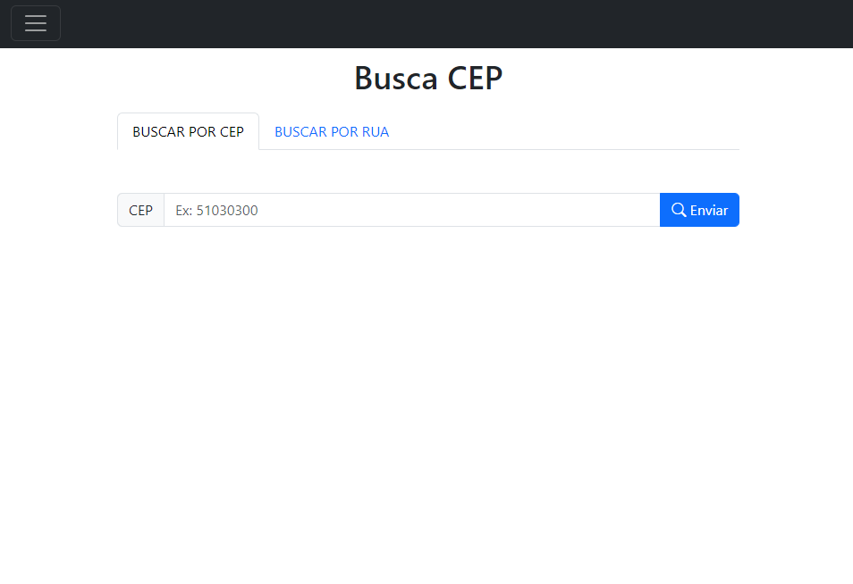

Ao digitar o CEP e clicar o enviar, uma função é disparada e realiza uma busca até a API do ViaCEP

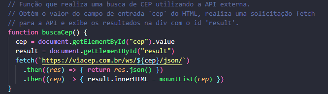

A partir disso, é gerado um card com a ajuda do Bootstrap devolvendo as informações necessárias para o usuário

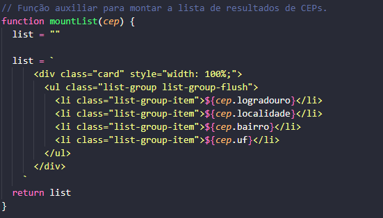
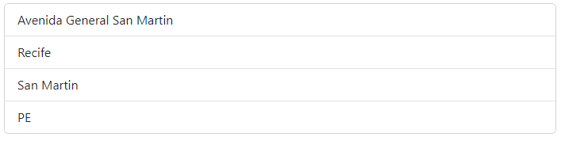

## Busca por Rua
Para fazer uma busca por rua, é nécessário ser passado para a API, o estado(UF) e a cidade, para listar ao usuário, utilizei a API pública do IBGE.

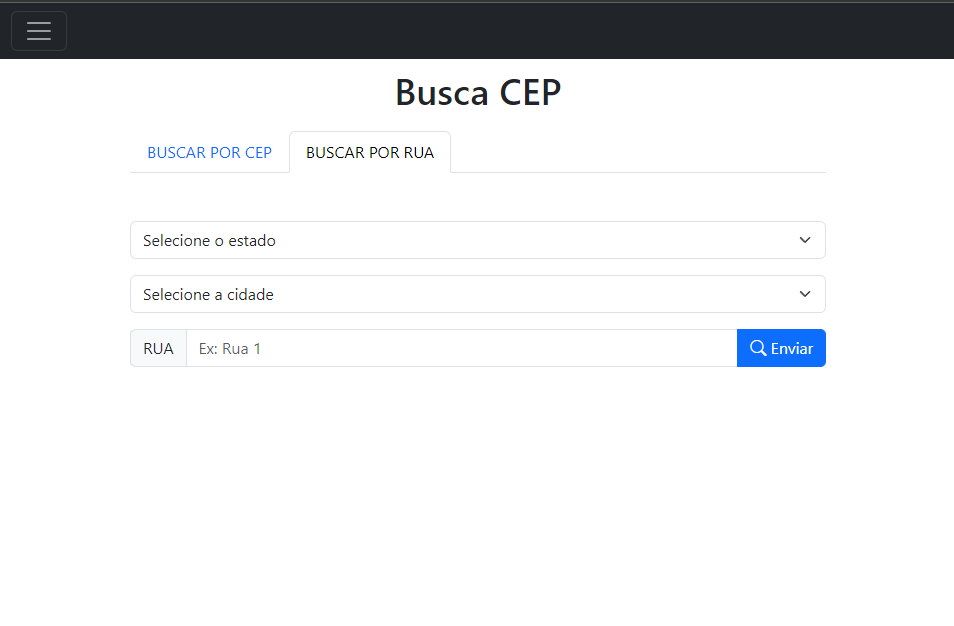

Ao clicar em selecionar um estado uma chamada é feita para a API pública do IBGE, listando todos os estados do Brasil, preenchendo a lista

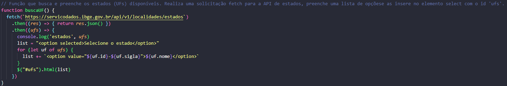
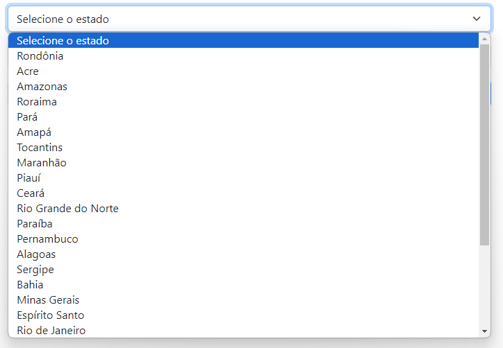

Depois, o estado selecionado é salvo e realizado uma nova busca para a API do IBGE, dessa vez listando as cidades do estado selecionado

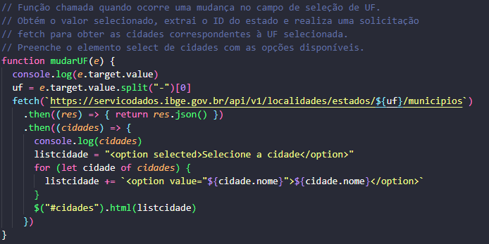
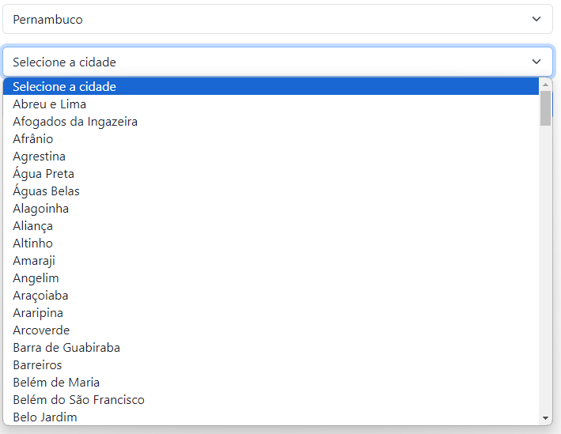

Após isso, quando selecionado o estado, a cidade e digitado o nome da rua, ao realizar a busca será devolvido ao usuário todos os resultados encontrados com as especificações passadas

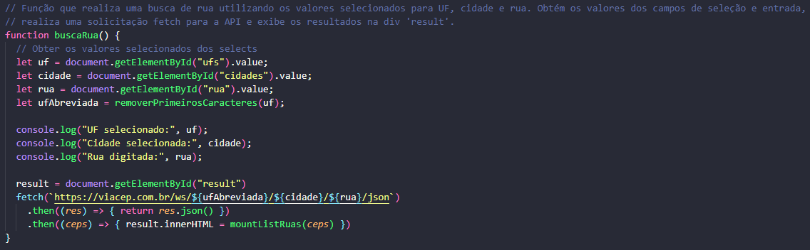
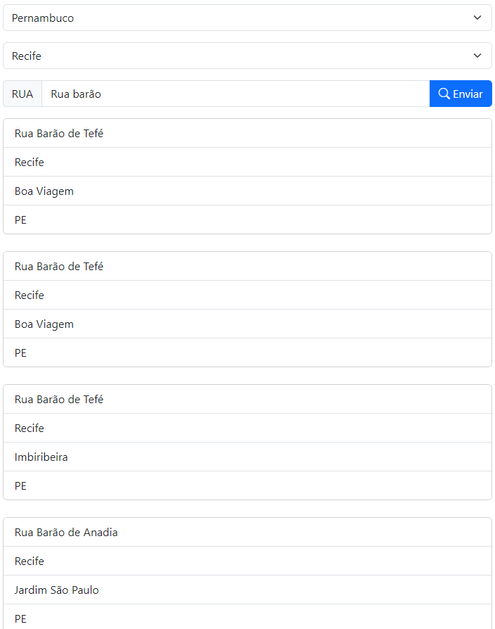